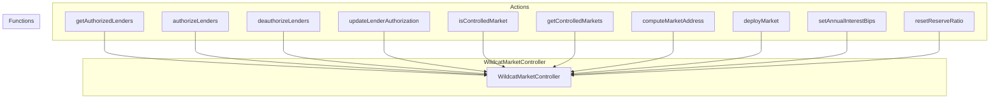
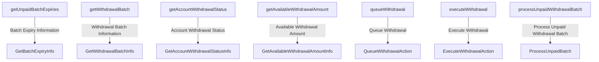

# The Wildcat Protocol Smart Contract Analysis

## Index
- [The Wildcat Protocol Smart Contract Analysis](#the-wildcat-protocol-smart-contract-analysis)
  - [Index](#index)
  - [1. Description overview of Wildcat Protocol](#1-description-overview-of-wildcat-protocol)
  - [2. The main contracts and the analyses of them](#2-the-main-contracts-and-the-analyses-of-them)
    - [a) WildcatMarketController.sol](#a-wildcatmarketcontrollersol)
    - [b) WildcatMarketBase.sol](#b-wildcatmarketbasesol)
    - [c) WildcatMarketControllerFactory.sol](#c-wildcatmarketcontrollerfactorysol)
    - [d) WildcatMarketWithdrawals.sol](#d-wildcatmarketwithdrawalssol)
  - [3. Approach taken in evaluating the codebase](#3-approach-taken-in-evaluating-the-codebase)
  - [4. Architecture](#4-architecture)
  - [5. Systemic and Centralization Risks](#5-systemic-and-centralization-risks)
  - [6. New insights and learning from this audit](#6-new-insights-and-learning-from-this-audit)
  - [7. Security Approach of the Project](#7-security-approach-of-the-project)
  - [8. Test analysis](#8-test-analysis)
  - [9. Packages and Dependencies Analysis](#9-packages-and-dependencies-analysis)
  - [10. Conclusion](#10-conclusion)

## 1. Description overview of Wildcat Protocol
Wildcat Protocol, an upcoming protocol on the Ethereum mainnet that aims to address issues in on-chain fixed-rate private credit. It differs from traditional on-chain credit models by requiring borrowers to create markets for specific assets, set rates, and specify lender addresses explicitly. The borrower doesn't need to provide collateral upfront but must maintain a reserve ratio within the market. Failure to do so results in a penalty interest rate. 
Importantly, Wildcat is a hands-off protocol with no underwriters, insurance funds, or proxies, primarily targeting sophisticated entities looking for on-chain credit agreements without third-party control. Borrowers and lenders can sign a master loan agreement, and the protocol operates around a single contract called "archcontroller."

> Warning🚨: the Wildcat Protocol is designed for advanced users and entities seeking on-chain credit agreements with control over underwriting, risk analysis, and credit scoring, and it operates differently from traditional credit models with a focus on market creation and reserve management. Borrowers must be attentive to maintaining the reserve ratio, and the protocol is strict in terms of sanctions, offering no safety nets like insurance funds or underwriters. 

## 2. The main contracts and the analyses of them 
> Note: These are the analyses of the contracts that we consider important or with very complex logic.

### a) WildcatMarketController.sol 
The `WildcatMarketController` contract is acts as a controller for managing the creation and authorization of markets within the Wildcat Protocol ecosystem. Here is an analysis of the important functions in the contract:

  1. **getAuthorizedLenders()**: This function allows getting the list of authorized lenders. It can accept a specific range of indices to obtain a paginated list of authorized lenders.

  2. **authorizeLenders(address[] memory lenders)**: This function allows the borrower to authorize a set of lenders to participate in the markets. Only the borrower can call this function.

  3. **deauthorizeLenders(address[] memory lenders)**: This function allows the borrower to revoke the authorization of a set of lenders in the markets.

  4. **updateLenderAuthorization(address lender, address[] memory markets)**: Updates the authorization of a lender for a set of controlled markets.

  5. **isControlledMarket(address market)**: This function checks if a specific market is under the control of this controller.

  6. **getControlledMarkets()**: Returns a list of markets controlled by this controller.

  7. **computeMarketAddress(address asset, string memory namePrefix, string memory symbolPrefix)**: Calculates and returns the address of the market based on the provided asset and name and symbol prefixes.

  8. **deployMarket()**: Allows the borrower or the factory controller (controllerFactory) to deploy a new market with specific parameters.

  9. **setAnnualInterestBips(address market, uint16 annualInterestBips)**: This function allows the borrower to adjust the annual interest rate in a specific market. If the new rate is lower than the current rate, the temporary reserve ratio is increased for the next two weeks.

  10. **resetReserveRatio(address market)**: Resets the temporary reserve ratio in a market that was previously increased due to a reduction in the interest rate.

The contract makes use of different data structures and libraries to carry out these functions, such as EnumerableSet for managing sets of addresses and other auxiliary libraries.

**Here a little flow of the functionalities:** 
> This contract deploys markets and manages their configurable parameters (APR, reserve ratio) and maintains set of approved lenders.

### b) WildcatMarketBase.sol
The ``WildcatMarketBase`` contract is an important part of the Wildcat protocol ecosystem and is responsible for managing a market. Here is an analysis of the key functions in this contract:

  1. **constructor()**: The constructor initializes the contract with market parameters such as the market controller's address, the underlying asset, fee values, delinquency grace period, and more. It sets the contract's immutable properties.

  2. **onlyBorrower() Modifier**: This modifier ensures that the function can only be called by the borrower (the contract owner). It checks if the caller is the borrower and raises an exception if not.

  3. **onlyController() Modifier**: This modifier ensures that the function can only be called by the market controller. It checks if the caller is the controller and raises an exception if not.

  4. **_getAccount(address accountAddress) Internal View**: This function is used to retrieve information about a given account, including its authorization status. If the account is blacklisted, it raises an exception.

  5. **_blockAccount(MarketState memory state, address accountAddress) Internal**: This function is used to block an account and transfer its market token balance to a guarantee (escrow) contract if it is not already blocked.

  6. **_getAccountWithRole(address accountAddress, AuthRole requiredRole) Internal**: This function is used to retrieve an account and ensure it has the required role. If the account does not have a defined role, it checks with the controller if it is authorized as a lender.

  7. **coverageLiquidity() External View**: Returns the amount of underlying assets that the borrower is required to maintain in the market to avoid delinquency.

  8. **scaleFactor() External View**: Returns the scale factor (in ray) used to convert scaled balances to normalized balances.

  9. **totalAssets() Public View**: Returns the total balance in underlying assets in the contract.

  10. **borrowableAssets() External View**: Calculates the amount of underlying assets that the borrower can borrow based on the total balance and other factors such as pending withdrawals and protocol fees.

  11. **accruedProtocolFees() External View**: Returns the amount of accrued and pending protocol fees in underlying assets.

  12. **previousState() External View**: Returns the state of the market as it was in the last update.

  13. **currentState() Public View**: Calculates the current state of the market, taking into account the accrual of interest and fees since the last update.

  14. **scaledTotalSupply() External View**: Returns the scaled total supply the market would have at the current block after applying interest and fees accrued and burning market tokens for the pending withdrawal batch if it has expired.

  15. **scaledBalanceOf(address account) External View**: Returns the scaled balance of a given account in the market.

  16. **getAccountRole(address account) External View**: Returns the current role of an account.

  17. **withdrawableProtocolFees() External View**: Calculates the amount of protocol fees that are currently withdrawable by the fee recipient.

  18. **effectiveBorrowerAPR() External View**: Calculates the effective interest rate currently paid by the borrower, which includes the base APR, protocol fee, and delinquency fee if the grace period has been exceeded.

  19. **effectiveLenderAPR() External View**: Calculates the effective interest rate currently earned by lenders, including the base APR and delinquency fee if the grace period has been exceeded.

> Note: These functions are critical for the operation of the Wildcat market contract and allow for account management, interest calculations, withdrawals, and other essential aspects of the market.

### c) WildcatMarketControllerFactory.sol
This contract, `WildcatMarketControllerFactory`, is a market controller factory that allows the creation of market controllers and the management of configurations for these controllers. Here is an analysis of the most important functions in this contract:

  1. `constructor(address _archController, address _sentinel, MarketParameterConstraints memory constraints)`: This is the contract's constructor, and it runs only once during contract deployment. It receives the address of the architecture contract (`_archController`), the address of the "sentinel" (`_sentinel`), which is used by the controller, and a `MarketParameterConstraints` struct that sets constraints for market parameters. This function initializes the contract's variables and stores the initialization codes for controllers and markets.

  2. `deployController() public returns (address controller)`: This function allows a user to deploy a new market controller. The controller is created using the `calculateCreate2Address` function and registered in the architecture contract. The function emits a `NewController` event with details of the new controller.

  3. `getProtocolFeeConfiguration() external view returns (...)`: This function returns the current protocol fee configuration, which includes the fee recipient, origination fee asset, origination fee amount, and protocol fee bips.

  4. `setProtocolFeeConfiguration(...) external onlyArchControllerOwner`: Allows the owner of the architecture contract to update the protocol fee configuration for new market deployments. It ensures that only the owner of the architecture contract can update the configuration.

  5. `getDeployedControllers() external view returns (address[] memory)`: This function returns an array of controller addresses that have been deployed through this factory.

  6. `deployControllerAndMarket(...) external returns (address controller, address market)`: This function allows a user to deploy a new controller and a new market through that controller in a single transaction. It takes many parameters to configure the market and controller.

> These are some of the key functions in the `WildcatMarketControllerFactory` contract. The contract is responsible for managing market controllers and their configurations, and it facilitates the creation of new controllers and markets. Additionally, it has some constraints and checks to ensure that deployments are secure and follow the rules set in the market and architecture configurations.

### d) WildcatMarketWithdrawals.sol
This contract, `WildcatMarketWithdrawals`, is part of a lending protocol and is responsible for managing withdrawal requests and batch processing of these withdrawals. Here's an analysis of the important functions in this contract:

  1. `getUnpaidBatchExpiries() external view`: This function allows users to retrieve the expiry timestamps of all unpaid withdrawal batches. Users can query this data to know when their withdrawal batches will expire.

  2. `getWithdrawalBatch(uint32 expiry) external view`: This function retrieves information about a specific withdrawal batch identified by its expiry timestamp. Users can check the details of a particular batch, such as the total amount and amount burned.

  3. `getAccountWithdrawalStatus(address accountAddress, uint32 expiry) external view`: This function provides the withdrawal status for a specific account at a given expiry timestamp. It returns data about the amount withdrawn, amount scaled, and other details for the account's withdrawal request.

  4. `getAvailableWithdrawalAmount(address accountAddress, uint32 expiry) external view`: Users can check the amount available for withdrawal for a specific account and expiry timestamp. It accounts for rounding errors and calculates the available amount based on the scaled amounts.

  5. `queueWithdrawal(uint256 amount) external`: This function allows a lender to queue a withdrawal request for a specified amount. It reduces the lender's balance, updates withdrawal batch information, and emits events. If there is no pending withdrawal batch, a new one is created.

  6. `executeWithdrawal(address accountAddress, uint32 expiry) external`: This function is used to execute a pending withdrawal for a specific account at the expiry timestamp. It handles the proportional amount of the paid batch owed to the account and, if the account is sanctioned, transfers the amount to an escrow contract.

  7. `processUnpaidWithdrawalBatch() external`: This function processes an unpaid withdrawal batch, distributing the available liquidity among the accounts with pending withdrawals. When a batch is fully paid, it is removed from the unpaid batch set.

> These functions manage withdrawal requests and ensure that withdrawals are processed correctly. The contract keeps track of withdrawal batches, allows withdrawals to be queued, and executes them when the corresponding batch expires. Additionally, it handles sanctions and escrow for sanctioned accounts during withdrawals.

**This is simple flow to explain the contract:**

## 3. Approach taken in evaluating the codebase
- High-level overview : I analyzed the overall codebase in one iteration to get a high-level understanding of the code structure and functionality.

- Documentation review : I studied the documentation to understand the purpose of each contract, its functionality, and how it is connected with other contracts.

- Literature review : I read old audits and known findings, as well as the bot races findings.

- Testing setup : I set up my testing environment and ran the tests to ensure that all tests passed. Used yarn and hardhat to test this protocol or foundry as well.

- Detailed analysis : I started with the detailed analysis of the code base, line by line. I took the necessary notes to ask some questions to the sponsors.

## 4. Architecture
The Wildcat protocol comprises three main components: controllers, the factory, and vaults. These components work together to facilitate the functioning of the protocol:

- **Controllers:** These entities manage permissions for both borrowers and lenders. Controllers define who can interact with the protocol. The address owning a controller is called the "archcontroller," responsible for specifying which borrower can deploy vaults using that controller. The Wildcat protocol itself typically operates as the archcontroller. Additionally, there's another Wildcat-operated multisig, referred to as the "sentinel," with limited powers to shift the balance and debt of a lender to an auxiliary escrow contract in cases involving sanctions. Importantly, the Wildcat protocol doesn't employ proxy upgrade patterns, making any deployed vaults immutable. It cannot upgrade vault logic, except for the sanctions-related powers of the sentinel. The protocol cannot access or take custody of any assets within vaults beyond the fees incurred by borrowers.

- **Factory:** The factory is responsible for deploying vaults by interacting with a controller. It contains the initialization code of a template vault, verifies and potentially rejects parameters provided by borrowers for a vault, and manages the deployment of instantiated vaults using CREATE2 logic.

- **Vaults:** Vaults are a central component of the protocol and have dedicated sections to explain their role and functionality. They play a crucial role in executing and managing transactions within the Wildcat protocol.

> See the following diagram to see how the components interact with each other

## 5. Systemic and Centralization Risks
As the entire platform is unupgradeable, migration in the event of a security hole or a black swan event will be challenging. The team should prepare multiple recovery scenarios and set up adequate action channels to prepare for such eventualities.

While the archcontroller represents the Wildcat protocol itself, the centralization of control within a single entity (or multisig) might pose systemic risks, particularly if the entity becomes compromised or makes unfavorable decisions. The powers of the sentinel to manage sanctions also introduce centralization.

The protocol explicitly states that it cannot access or take custody of assets within vaults beyond borrower-incurred fees. This limitation ensures user asset control but could pose challenges in emergency scenarios or recovery processes.

## 6. New insights and learning from this audit
These are a couple of things that we learned from this project trough the contracts and documentation provided by the `wildcat team`:

  1. **Customizable Market Creation:** The contracts provided offer a mechanism for creating custom markets with unique configurations and settings. This level of customization is essential for catering to various asset types and borrower requirements.

  2. **Protocol Fee Flexibility:** The ability to configure protocol fees for new market deployments offers flexibility in revenue generation and fee structures. The contract allows for fee adjustments while ensuring certain constraints are met.

  3. **Parameter Constraints:** The introduction of parameter constraints for interest rates, reserve ratios, delinquency fees, and other factors enhances risk management and ensures market stability. These constraints prevent extreme or unsustainable market configurations.

  4. **Batch Withdrawal Processing:** The `WildcatMarketWithdrawals` contract includes batch processing for withdrawal requests. This mechanism optimizes gas costs and facilitates efficient handling of multiple withdrawal transactions in a single batch.

  5. **Automated Withdrawals:** The system supports automatic withdrawal processing when withdrawal batches expire. This feature streamlines the distribution of funds to lenders, reducing manual intervention.

  6. **Sanctioned Account Handling:** In case of sanctions against an account, funds are sent to an escrow contract specific to that account. This approach enhances security and compliance with legal requirements.

  7. **Integration with an Arch-Controller:** The contracts require authorization or ownership by an "arch-controller" for certain operations. This design integrates external control mechanisms for ensuring proper market management and governance.

  8. **Dynamic Market Scaling:** The contracts introduce scaling mechanisms for market parameters, such as withdrawal amounts. This ensures efficient allocation of funds and minimizes rounding errors.

  9. **Flexible Fee Models:** The contract provides options for protocol fees and origination fees, allowing a diverse range of fee structures to be applied to different markets.

  10. **State Management:** The contracts manage the state of the market and keep track of various data, including withdrawal batch information, account statuses, and more.

> These insights highlight the robustness and adaptability of the provided smart contracts, which are designed to handle complex market scenarios while adhering to predefined constraints and integrating governance control.

## 7. Security Approach of the Project
What the project can add in the understanding of Security;
- By distributing the project to testnets, ensuring that the audits are carried out in onchain audit. 

- Pause Mechanism This is a chaotic situation, which can be thought of as a choice between decentralization and security.

- Add On-Chain Monitoring System; If On-Chain Monitoring systems such as Forta are added to the project, its security will increase.

For example ; This bot tracks any DEFI transactions in which wrapping, unwrapping, swapping, depositing, or withdrawals occur over a threshold amount. If transactions occur with unusually high token amounts, the bot sends out an alert. https://app.forta.network/bot/0x7f9afc392329ed5a473bcf304565adf9c2588ba4bc060f7d215519005b8303e3

- After the Code4rena audit is completed and the project is live, I recommend the audit process to continue, projects like immunefi do this. https://immunefi.com/

## 8. Test analysis
The coverage test is >90%, but it should be 100% to increase the safety.

## 9. Packages and Dependencies Analysis

| Package                                                                                                                                     | Version                                                                                                               | Usage in the project                               | Audit Recommendation                                                                                                             |
| ------------------------------------------------------------------------------------------------------------------------------------------- | --------------------------------------------------------------------------------------------------------------------- | -------------------------------------------- | -------------------------------------------------------------------------------------------------------------------- |
| [`openzeppelin`](https://www.npmjs.com/package/@openzeppelin/contracts)         |      |    openzeppelin-contracts/utils/structs/EnumerableSet.sol |-  Version `4.9.3` is used by the project, it is recommended to use the newest version `5.0.0`                                                                                          |
| [`solady`](https://www.npmjs.com/package/solady)                                                                                        |    | SafeTransferLib  |  - The latest updated version is used.    - An updated audit of the solady library was done by SpearBit last week, I recommend checking this out [Audit Report](https://github.com/Vectorized/solady/blob/main/audits/cantina-solady-report.pdf)                                                                                  |

## 10. Conclusion 
In general, the Wildcat  project exhibits an interesting and well-developed architecture we believe the team has done a good job regarding the code, but the identified risks need to be addressed, and measures should be implemented to protect the protocol from potential malicious use cases. It is also highly recommended that the team continues to invest in security measures such as mitigation reviews, audits, and bug bounty programs to maintain the security and reliability of the project.

### Time spent:
25 hours